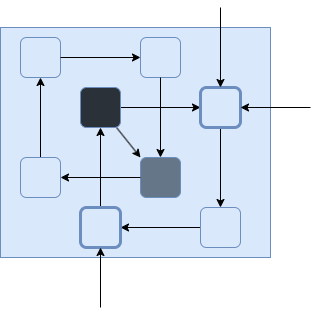

== Breakdowns

=== Breakdown

La technique consiste à passer d'une situation confuse à une situation plus simple où des éléments sont en relation entre eux sans distinction.

Notre cerveau ne sait pas comment appréhender la situation.

.Complexe et compliqué

=== Breakdown

La première étape consiste à repérer des "clusters", des regroupements d'éléments particulièrement reliés entre eux.

.Distinction de clusters

=== Breakdown

Ensuite il faut les identifier ou au moins les nommer.

.Identifications de clusters

=== Breakdown

Après, il faut créer des ensemble les plus disjoints possibles

.Regroupement par clusters

=== Breakdown

Et isoler ces ensembles autant que possible les uns des autres en conservant les relations.

.Établissement des frontières

=== Breakdown

En prenant de la hauteur, le problème peut être appréhendé comme un ensemble plus réduit.

.Complexité réduite à haute échelle, zoom vers le haut

=== Breakdown

En zoomant sur un composant, il est engin possible de ce focaliser plus aisément

.Focus sur un sous-composant, zoom vers le bas

=== Breakdown

Voire de le considérer de façon totalement ou presque, isolé.

.Limitation à un sous-composant de niveau N+1

=== Breakdown

Ce processus peut se renouveler au sein du sous-composant lui-même

.Décomposition en sous composants de niveau N+2

=== Breakdown

Permettant de pouvoir mieux cerner une partie précise et réduite du système

.Focus sur un sous-composant, zoom vers le bas

