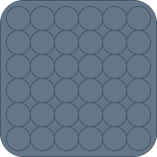
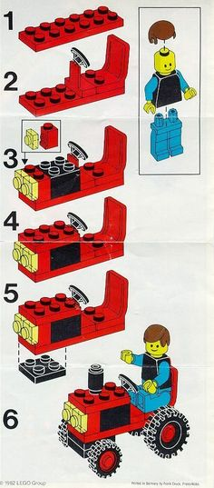
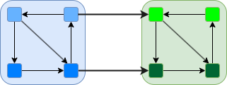

= Refactoring, Optimisation and Agility
ifdef::backend-revealjs[]
include::_inc_revealjs.adoc[]
endif::[]
ifndef::backend-revealjs[]
:toc: left
:toc-title: Table des matières
:toclevels: 4
:doctype: book
endif::[]
include::_inc_context.adoc[]
:print-detail: true
:print-timing: true
:ROLE: notes
:include_options: tag=content

== Introduction

[NOTE.note]
--
Les développeurs et développeuses, que ce soit dans un contexte d'agilité ou pas, pratiquent le refactoring.

Pourtant, c'est un sujet rarement abordé en tant que soi, alors que c'est un domaine très riche. 
Alors qu'il peut paraître très technique, ce thème me semble une opportunité de prendre un peu de recul sur notre métier et le contexte propre au milieu de l'Enseignement Supérieur et de la Recherche.

Ce que je vais dire est une réflexion personnelle basée sur mon expérience, en tant qu'ingénieur, mais aussi membre de jury et surtout ancien animateur du réseau DevLOG.

Nous avons, dans le domaine du développement logiciel, des répartitions de profils qui ne se retrouvent pas ailleurs.

Les personnes en charge du développement logiciel ne proviennent pas ou peu, de mon expérience, de formation orientées développement logiciel. 
Les rares candidatures que nous avons reçus sont généralement découragées par nos niveaux de salaire et nous le constatons à travers des difficultés de recrutement qui sont de plus en plus criantes. 
Les salaires offerts ne sont pas attrayants, surtout sur le marché du développement, ce qui induit une représentation différente de ce que l'on peut trouver dans les entreprises par exemple.

Nous rencontrons des personnes qui veulent donner un sens à leur activité (c'est mon cas), mais aussi des personnes qui viennent d'abord par intérêt pour le domaine, puis pour le métier.

Globalement nous avons plus de personnes qui vont vers le développement que de personnes qui en viennent. 
Nous avons donc des gens avec des backgrounds et des cultures très diverses: certains ont un parcours résolument scientifique et se retrouvent à poursuivre en tant qu'ingénieur.

Nous avons également une appréciation du temps et des compétences très dépendant de la proportion croissante de recours à des CDD avec lesquels l'investissement dans le temps ne peut être que différents.

Nous avons enfin une forme de dépréciation des exigences du développement, ce que j'appelle la culture du tombe-en-marche: puisque dans un contexte de laboratoire, beaucoup de personnes en position de responsabilité peuvent ou ont pu écrire des lignes de code, elles ont tendance à minorer les efforts nécessaires pour avoir un code de qualité.

Tout cela pour dire que les attentes et les compétences attendues ou raisonnablement réalisables ne sont pas uniformes, mais dépendent beaucoup de plusieurs variables :

* Trajectoire
* Background
* Culture technologique (java, python, C/C++, PHP, ...)
* Appétence pour le développement plus ou moins marquée

C'est pourquoi je propose d'envisager cette présentation sous deux angles et trois profils

Angle: 
* Développement
* Gestion de projet

Profils
* Compétence annexe / Pratique Occasionnelle
* Compétence principale / Pratique quotidienne
* Expertise

--

=== Que faisons-nous ?

* Nous traduisons des pensées humaines en code executable
* Et vice-versa, nous essayons aussi de comprendre un code en termes humains
* Cette traduction est imparfaite, car ces deux visions ne sont pas bijectives
* Traduire, c'est trahir

=== Complexité

**Complexité inérante au problème**

La situation peut rapidement devenir complexe, surtout si le problème à régler n'est pas lui même simple. 

**Saturation** 

* La traduction peut saturer nos capacités
** Trop d'éléments à prendre en compte
** Trop de relations, statiques ou dynamiques

//TODO Schéma

* Complexité vs Complication ?
** *_Complexe_* s'oppose à *_simple_* => *_indirecte_*,
** *_Compliqué_* s'oppose à *_facile_* => *_difficile_*.

[NOTE.notes]
--
La construction d'une solution logicielle. Les nombreux éléments en interaction, qui s'influencent mutuellement. De plus il y a plusieurs aspects à prendre en compte: la sécurité, la cohérence de l'application, les domaines métiers, les tests, etc. 
L'un des risques principaux est de perdre de vue ce que l'on souhaite faire, de s'éparpiller, d'être un peu en état de stupeur devant l'ensemble des connaissances à mobiliser.
--

**=> Il va falloir gérer la complexité _à déplacer_ ?**

=== Comment nous assurer que nous le faisons bien ?

* Utiliser les https://en.wikipedia.org/wiki/ISO/IEC_9126[normes qualités 9126]
* Nous allons nous limiter à deux aspects
** _Capacité fonctionnelle_, en tant que réponse aux besoin d'un client, partie de sa satisfaction.
** _Maintenabilité_

=== Agilité

L'agilité est une démarche qui prend pour partie de ne pas prétendre dès le départ à être exhaustif, mais d'apporter des incréments de fonctionnalités et de s'assurer que le client est heureux.

Sur le plan purement technique, nous pouvons constater que

* Travail en itération par incrément de fonctionnalité
* Recherche de cycles courts et de feedback client
* Conception (_Software Design_) toujours en évolution
* Une recherche de l'excellence technique
* Une remise en cause et une adaptation permanente

=== TODO transition

**Ce n'est pas parce qu'un logiciel fonctionne qu'il est bon**

**TODO** mettre ici image du chien

L'essence du développement logiciel, c'est de pouvoir faire évoluer un logiciel, surtout en agilité.

=== Maintenabilité

[%step]
[.left-column]
* Faciliter la *compréhension*
* Faciliter l'*analyse*

[%step]
[.right-column]
* Faciliter la *modification*
* Faciliter les *tests*
* Faciliter l'*assemblage des composants*

[NOTE.notes]
--
* Faciliter la compréhension
** *Que* font les composants ?
** *Comment* le font-il ?
* Faciliter l'analyse
** Trouver *qui* est responsable de *quoi*,
** Évaluer l'*impact* d'une modification,
** *Diagnostiquer* rapidement les *erreurs* en cours d'exécution.
* Faciliter la modification
** *Corriger* des bugs,
** *Améliorer* des parties de code,
*** Meilleures performances
*** Économiser des ressources
** _Le tout sans redouter que cela ne vous éclate à la figure._
* Faciliter les tests
** *Concevoir* des tests,
** *Écrire* des tests,
** Les *exécuter* le plus fréquemment possible.
--

=== Dette technique

Au cours d'un développement, des compromis, des maladresses ou des raccourcis font gagner du temps et des ressources, mais qui pénalisent la maintenabilité de l'application et sa faculté à évoluer.

Métaphore de la dette à rembourser

Pour 10$ de gagner, je devrais rembourser 15$ pour revenir à un niveau acceptable.

//TODO faire un schéma

La dette technique d'une itération (sprint) peut compromettre le sprint suivant (notion de vélocité)

**Il ne peut y avoir d'Agilité sans prise en compte de la dette technique**

// TODO insérer Technical Debt Martin Fowler

**=> Refactoring, outil de gestion de la dette technique**

=== Comment mesurer la dette technique ?

* La dette technique est l'effet délétère de l'écart à ce qu'il aurait été souhaitable de faire.
* Comment définir ce qu'il aurait été souhaitable de faire ?
* Référentiel de bonnes pratiques
** Choix de la communauté 
** Heuristiques propre à chaque écosystème
** Principes reconnus comme universel (Code Clean)
** Les Design Patterns (GoF, GRASP, ...)
** et leurs contraires:
*** Anti patterns
*** Bad smells
* Système d'analyse qualité
* Linters

[NOTE.notes]
--
Les moteurs d'analyse qualité sont des outils très puissants, le plus connu étant sonarqube. Mais il n'est pas forcément nécessaire d'utiliser, encore moins de mettre en oeuvre, un tel système pour avoir une idée des écarts manifestes et corrigeables. Des linters suffisent.
--

== Refactoring : Définition

La gestion de la dette technique passe par le _refactoring_ ou _refactorisation_

* _Refactorisation_:
** Modification de la structure interne d'un logiciel afin de le rendre plus facile à comprendre et moins coûteux à faire évoluer sans changer son comportement observable
* _Refactoriser_: 
** Restructurer un logiciel en appliquant une série de refactorisations sans changer son comportement observable

=== Refactoring : Concepts clef

* La modifications du code en soi comme principal sujet
** Comment bien procéder
** La bonne exécution est considérée comme satisfaisante
* Amélioration _qualités internes_
** => préoccupation du développeur
* Conservations _qualités externes_
** => ne concerne pas l'utilisateur
**** L'utilisateur ne sait pas que le remaniement a eu lieu
* Consommation de ressources
** => Préoccupation de la gestion de projet
*** Le Product Owner doit comprendre les bénéfices du refactoring 

[NOTE.notes]
--
La grille de lecture du refactoring ne porte pas sur l'exécution d'un programme, car on le suppose suffisamment satisfaisant le temps de procéder à la modification de son code. Le refactoring se concentre la notion de modification du code et ses effets comme objets principaux. 
De même l'ingénierie navale cherche à minimiser l'impact des avaries et des voix d'eau sur un navire, le refactoring cherche à l'impact des modifications sur un code.  
--

=== Refactoring : Mantra priuncipale

Expliquer ici que le refactoring se concentre sur la construction du code, et pas sur son exécution, que l'on supposera satisfaisante.

Le refactoring se concentre sur le code et non pas sur l'exécutable. 
Le refactoring vise à 

* minimiser les efforts des humains, 
* éviter les réactions en chaine lors des modifications
* limiter ses efforts sur un aspect

**Mettre un chateau de cartes**

=== Refactoring : Objectifs ?

[.simple]
* Faciliter la compréhension
* Améliorer la conception
* Améliorer la confiance
** Rendre le code le plus facile à tester possible
* Faciliter la correction des bogues
* Faciliter les futurs évolutions 

=== Refactoring : Quand ?

* Quand refactoriser
** Avant d'ajouter une nouvelle fonctionnalité (_Feature_)
** Quand la mise sous tests est problématique
** Quand le code semble obscure ou ésotérique, bien qu'il fonctionne
** Quand des petits défauts sont repérés (_Boy Scout Rules_)
** Lors d'une revue de code ou d'une analyse qualité

* Quand ne **PAS** refactoriser le code ?
** Quand il est plus facile de le réécrire from scratch
*** On ne tire pas sur une ambulance :/
** Quand il n'y a pas de bonnes raisons de le faire

=== Refactoring : Concrètement ?

* Le refactoring est un ensemble de techniques et d'habitudes, qui vont des plus simples aux plus complexes
* Martin Fowler les a formalisé dans son célèbre ouvrage.

=== Refactoring : Catégories

**Lister les categories**

=== Refactoring : Techniques

**Lister les techniques**

=== Refactoring : L'esprit plutôt que la lettre
 
* Avoir un fil conducteur plutôt qu'un catalogue
** Pertinence variable des méthode recensées
*** Techniques moins cruciales grâce aux outils existants
*** IDE, linters
* Objectifs
** Pour les développeuses et développeurs
*** Lever le nez du guidon
*** Prendre de la hauteur
** Pour les chef(fes) de projet
** Comprendre l'importance du refactoring
** S'en faire l'avocat lors des arbitrages
* Pour tous
** _Evangéliser_ auprès de vos collègues

=== Approche du refactoring selon trois axes

* 
** Cognitif
** Conception
** Testabilité

== Agenda

* Tests
** Bref rappel
* Vue du cerveau
* Faciliter la compréhension
* Améliorer la conception
* Faciliter la testabilité
* Application avec du code legacy

== Test 101

Un rapide rappel sur les tests automatisés

== Cognitif

Le cerveau premier compilateur

défaut

**Insérer slides classiques**

== Ecriture 

=== Empilement de ligne de codes

=== Lecture et règles de nommage

=== Exercice de réécriture

=== Lecture et niveaux d'importance

**Exemples star treck**

== TP partie lecture

Methodes de refactoring à illustrer

* renommer une variable
* renommer une methode
* extraire une fonction

Scénario

Fournir deux codes avec un rapide descriptif, tous les deux dans la même thématique.

par exemple

Deux système d'exploitation d'un instrument de type heliostat

* Un code verifie la disponibilité du capteur et si il remplie toutes les conditions nécessaires.
* Un autre code qui exploite le capteur en lui donnant des directives genre direction, nature des fichiers à enregistrer

== Améliorer la conception

* _Software Design_
** Traduction sous forme de code d'une solution à un problème humain.
* Ensemble de décisions 
** représentation et de structuration des données et des traitements
**  Pour satisfaire aux critères de Qualité Logicielle

[NOTE.notes]
--
Architecture logicielle vs conception logicielle.
La différence entre les deux peut être plus ou moins nette, notamment en fonction de la complexité et la taille du logicielle.

Nous retiendrons que l'architecture logicielle est une à haut-niveau, aussi agnostique et indépendante de l'écosystème (langages, frameworks, ...) que possible.
Elle fait le lien entre les exigences fonctionnelles et les réponses apportées.

La conception logicielle s'attache plus à la structuration du code, des données et des traitements, la définitions des entités et l'utilisation des mécanismes du paradigme utilisé (OOP, fonctionnel, impératif, ...) 

Dans certaines situations, le framework sous-jacent est tellement invasif qu'il à tendance à contraindre l'architecture logicielle.
Nous ne nous étendrons pas sur la pertinence ou non de ce mode de fonctionnement.
--

=== Amélioration dans le cadre du refactoring

Dans le cadre du refactoring, nous partons d'une situation donnée

* Conservation du comportement observable
** Principalement _Fonctionnel_
** Souvent aussi _Sécurité_ et _Performance_
* Améliorations des aspects internes uniquement
** Gestion de la complexité
** Ne pas verrouiller le futur
*** Réduire la dette technique du passé en gardant un oeil sur l'avenir
** Améliorer le niveau de confiance
*** Rendre le code plus testable pour le rendre plus testé

[NOTE.notes]
--
Le comportement observable, c'est ce que perçoit un utilisateur du système _de l'extérieur_, ce que nous pouvons résumer grossièrement à trois aspects : les fonctionnalités offertes, la sécurité, les performances.

Dans le cadre du refactoring, nous considérons qu'aucune évolution dans ces 3 domaines n'est à considérer, même si il est effectivement courant de faire un refactoring pour améliorer les performances ou minimiser la consommation de ressources.

Pour la sécurité dans la conception, cf NSFAW
--  

== Gestion de la complexité

* La complexité sature les capacités du cerveau humain
* Nous sommes plus performants sur de petits modèles qui tiennent dans notre mémoire de travail que sur de gros ensemble.

image::images/zoom.gif[width=50%]

La première étapes quand on est face à un problème que l'on arrive pas à faire tenir en tête, c'est de le découper en petits problèmes

**Inclure ou pas le breakdown**

== Quel est le problème : data + traitement

Un programme informatique, c'est 

* data + traitement

* Description des données
* Description des traitement

**Pas d'illustration trop naïves ou en bas côté**

== Modularité

* Condition nécessaire à la modularisation
** En application la décomposition d'un ensemble complexe en sous-éléments moins complexes, nous faisons un premier pas vers la modularisation.
** C'est une condition nécessaire mais pas suffisante. 
* Un sous-composant peut-être considéré comme un module si 
** il est suffisamment 
*** autosuffisant, 
*** identifiable 
*** et potentiellement réutilisable.

Cela permet de percevoir un système complexe comme un jeu de construction.

[NOTE.notes]
--
Par module, nous désignons une entitée de programmation, cela peut-être une classe, un module python, un package java, cela peut dépendre des paradigmes de l'écosystème utilisé.
--

== Comment relier les données au traitement ?

L'écosystème utilisé conditionne la façon de construire la solution, et donc des module.

Les paradigmes les plus courants sont

* Approche Procédurale
* Approche Object
* Approche fonctionnelle

Je n'aborderait la programmation fonctionnelle, car je n'ai pas d'expérience dans le domaine.

Nous allons voir comment ces paradigmes permettent de gérer la complexité ou pas.

=== Procédurale

**intruire puppet master**

* Disjoint
** La relation doit être établie
* Déséquilibré
** Les algorithmes détiennent toutes les *connaissances*.
** Les structures de données sont "stupides".

**illustration**

=== Structuration des données 

La structuration des données contribue la modularisation des données en regroupant les data 

* Une meilleure structuration des données aiderait
** La _forme_ des données détermine l'expressivité de la procédure
* Une conception intelligente des données 
** met en avant ce qui est important
Mettre en avant ce qui est important 
** Mettre en arrière les détails non pertinents

**Mettre dessin https://code-club.io.ias.u-psud.fr//assets/presentations/oop101/index.html#/_data_structuring_6**

== Regroupement des données et des traitements

* Co-localistion des savoirs nécessaires à la compréhension d'un code
** Cas des modules en python
* Le travail de regroupement des informations est toujours à faire par le développeur à l'aide du système de vérification du langage (compilateur, runtime)
* La connaissance est facilité

== Programmation orienté objet

* Entité en tant que _tout_
** _Objet
** Données et procédures sous le même toit

* L'entité a des comportements
** L'entité est active
* La connaissance se trouve dans l'entité

*mettre https://code-club.io.ias.u-psud.fr//assets/presentations/oop101/index.html#/_object_oriented_programing_2**

*mettre https://code-club.io.ias.u-psud.fr//assets/presentations/oop101/index.html#/_size_of_project**

== Comment établir un module ?

* Frontière
** Séparation entre composants
** Frontière au sein des sous-composant
** Question d'échelle où l'on se place
* Critères
** Comment savoir ce qui va ensemble et ce qui est différent ?
* Interface
** Comment interagir avec les autres modules

[NOTE.notes]
--
Les mathématiques ont développé la théorie des ensembles pour traiter de ce genre de question. Toutefois, aussi belle et pertinente soit-elle, ce n'est pas forcément elle qui va être la plus utile au quotidien aux développeuses et développeurs qui doivent faire face à tas de lignes de code qui sont tout simplement impossible à comprendre sans sentir le tournis.

Ce que veulent faire ces personnes, c'est trouver le moyen d'établir les frontières et les critères qui permettent de savoir si un ensemble d'instructions font parties d'un ensemble ou non.

Cette question est presque d'ordre générale pour l'humain : il passe son temps, parfois à son corps défendant, à tout classer. Les événements, les éléments de la nature, les sons, les situations et aussi les autres humains, afin de pouvoir se faire l'économie d'une réflexion et d'une écoute. De même que le cerveau filtre ce qu'il veut ignorer pour éviter la saturation, comme l'herbe dans le dos quand nous sommes allongés au soleil dans un parc, mais qu'il est capable de regarder attentivement sur des araignées et des fourmis sont aperçues dans le proche voisinage.

Établir des frontières, des interfaces, des critères, c'est une technique de minimisation de l'effort cognitif.
Ca tombe bien, car c'est notre objectif aussi.
--

== Cohésion, couplage et abstraction

Pour qualifier un module, on utilise souvent trois propriétés

* La cohésion d'un module
* Le couplage entre modules
* Le niveau d'abstraction du module

== Cohésion

* Définition de la cohésion.

[quote]
____
La cohésion indique à quel point les différentes parties d'un module sont liées entre elles et comment elles se concentrent sur la réalisation d'un objectif commun spécifique.
____

**Regarder dans le carnet**

Il est reconnu plusieurs types de cohésions (cf.Pressman)

== Couplage

**Piocher les idées dans le cours framework_2019** 

== Abstraction

L'abstraction, c'est la extraction des caractéristiques essentielle d'une entitée sans se préoccuper de sa forme concrête. C'est une forme de simplication de la réalité pour plus aisément manipuler ou définir des types d'entitée plutôt que les entitée elle-même.
Les caractéristiques principales étant les attributs et les interactions possibles de cette entitée.

Par exemple : 

**trouver un exemple, type "Juge"**

L'abstraction est souvent le fil d'arianne qui permet de passer d'un concept humain à une entitée qui existe sous forme de code.

Typiquement, l'abstraction _Moteur_ peut-être utilisée dans la modélisation d'un véhicule et se traduire par une classe `class Engine:`` en python et/ou une classe `Engine` en java.

De même qu'en conception, nous nous concentrons sur les caractéristiques essentielles qui apportent une réelle fonctionnalité, en code nous nous concentrons sur les données et les traitements essentiels

== Abstraction suivant les paradigmes

En programmation Orientée Objet, nous rencontrons généralement deux type principaux d'abstraction

* l'interface, qui décrit uniquement les attributs et les interactions possibles d'un type, sans se préoccuper de comment le faire. Une interface correspond au **WHAT** sans **HOW**
* la classe abstraite, qui décrit les attributs et les interactions possibles d'un type, mais en fournit également une concrétisation partielle. La classe abstraite ne peut exister sans rafinement possible. Elle répond à la fois à la question **WHAT** et partiellement à **HOW**

=== Abstraction par langage

=== Abstraction en java

Interface

[source,java,attributes]
----
interface Door {

    void open();

    void close();

    boolean isOpened();
}
----

Classe abstraite

[source,java,attributes]
----
abstract class AbstractDoor {

    private boolean status;

    protected abstract boolean doOpen();
    protected abstract boolean doClose();

    void open(){
        status = doOpen();
    }

    void close(){
        status = ! doClose();
    }

    boolean isOpened() {
        return status;
    }
}
----

Concrétisation

[source,java]
----
class DrawbridgeDoor extends AbstractDoor {
    private Drawbridge bridge = new Drawbridge();

    protected boolean doOpen(){
        this.bridge.lift(true);
        return this.bridge.isLifted();
    }
    protected boolean doClose() {
        this.bridge.lift(false);
        return ! this.bridge.isLifted();

    }
}
----

ou utilisation de l'interface `Door`

Concrétisation

[source,java]
----
class DrawbridgeDoor implements Door {
    private Drawbridge bridge = new Drawbridge();

    void open(){
        this.bridge.lift(true);
    }
    void close(){
        this.bridge.lift(false);
    }
    boolean isOpened() {
        return this.buld.isLifted();
    }    
}
----

ou un mix des deux

[source,java,attributes]
----
abstract class AbstractDoor implements Door{
    ...
}
class DrawbridgeDoor extends AbstractDoor {
    ...
}
----

== Abstraction en Python

* Duck walking
* AbstractClass
* Prototype

=== Abstraction en Python : Duck Walking

Le python est un langage de gentlemen, qui se comportent comme il se doit.
Aussi Python n'a pas les mécanismes de Java, comme un typage fort et statique.
Le python ne vérifie jamais le type d'une entitée, il se contente d'utiliser les méthodes qui sont attendues.

Il n'y a pas de mot-clef interface comme en _java_ !

La principale abstraction en Python, c'est le Duck Walking

[quote]
____
si ça ressemble à un canard, si ça nage comme un canard et si ça cancane comme un canard, c'est un canard
____

=== !

[source,python,attributes]
----
class Door:
  def open(self):
      pass
  def close(self):
      pass

class Oven:
  def open(self):
      pass
  def close(self):
      pass
----

[source,python,attributes]
----
def open_and_close(door):
    door.open()
    dosomething()
    door.close()

open_and_close(Door())
----

[source,python,attributes]
----

class Oven:
  def open(self):
      pass
  def close(self):
      pass

open_and_close(Oven())
----

Alors qu'en java

[source,java,attributes]
----
class Operator {
    void openAndClose(Door door) { ... }
}

operator.openAndClose(new Door()) // OK
operator.openAndClose(new Oven()) // KO ne compile pas
----

=== Abstraction en Python : renforcement avec ABC

La vérification ne se fait que au runtime lors de la définition d'une classe, mais toujours pas d'incompatibilité de type si le Duck Walking est respecté

**FAIRE LE CAS ICI**

[source,python,attributes]
----

A FAIRE
----

== Définition d'un bon module

L'object de la refactorisation est de pouvoir transformer le code de façon à avoir des modules  qui présentent les caractéristiques

* Forte cohésion
* Faible couplage
* Niveau d'abstraction adapté

=== Couplage et cohésion

Comment, maintenant que nous avons défini ces notions, pouvons nous **améliorer les choses** ?

Il existe des métriques, mais elles ne sont pas évidentes à utiliser au quotidien.

**TODO** décrire les métriques

Couplage et cohésion sont des aspects liés: **A REFAIRE**

* Par exemple un fort couplage entre modules affaiblie géneralement diminue la cohésion de ceux-ci **FAUX**
* Une faible cohésion augmente le risque de couplages et une dispersion.

Quel est la bonne pperception à garder en tête ?

La **minimisation des connaissances nécessaires** <= Analogie **subdivision du travail**

== Subdivision du travail

Imaginer que vous avez le logiciel de vol d'un instrument spatial embarqué sur un satellite dans le cadre d'une mission de l'ESA.
Le logiciel de vol est composé 

* d'un système de communication avec le logiciel de bord du satellite, 
* d'un module de la mémoire de bord, 
* d'un module de dialogue et pilotage avec le système optique, 
* d'un module de dialogue avec les sondes de températures, 
* d'un module de dialogue avec les systèmes de calibration, les systèmes mécaniques etc...

On perçoit aisément que les domaines d'expertises sont très variés, et que la bonne attitude est de confier les modules à ceux qui savent.

C'est le subdivision du travail en fonction de l'expertise nécessaire. Vous n'aller pas confier le module de pilotage du système optique au service thermique !

Pourquoi ?

Parce que vous faite l'hypothèse raisonnable que les experts font mieux ce pour quoi ils sont experts que lorsqu'ils vont s'aventurer dans un domaine en dehors de leur expertise.
Car ainsi il se focalisent sur ce qu'ils savent très bien faire et minimisent les connaissances nécessaires

== Cohésion et connaissance

* Vision tournée vers l'intérieur
* Minimisation des connaissances nécessaires
** Diminution taille du _buffer_ cognitif
* Association à une domaine d'expertise le plus réduit possible.

[NOTE.notes]
--
La cohésion correspond à la minimisation des connaissance nécessaire à la compréhension d'un module. C'est une vision interne au module.

* Un module à forte cohésion pourrait être placé sous la responsabilité d'un expert dont le savoir est concentré sur un domaine précis à une échelle donnée.

Par exemple au sein d'un logiciel de vol tel que décrit précédemment, le module pilotage de l'électronique principale sera plutôt confié à un ou une spécialiste de l'électronique de l'instrument.
Au sein de ce module pilotage

* la partie compression de données peut être confié à un expert compression
* la partie gestion de la puissance confié à un expert électronique de puissance
* etc...
--

== Couplage et connaissance

* Vision des relations entre modules
* Augmentation des connaissance nécessaires
** Augmentation taille _buffer_ cognitif
* Implication de plusieurs domaines d'expertise

[NOTE.notes]
--
Le couplage correspond à l'augmentation de la connaissance nécessaire de plusieurs domaines d'expertise.
Du point de vue d'un concepteur de module, le couplage implique une connaissance plus ou moins poussée de modules autre que le sien.

Pour reprendre notre exemple, un fort couplage serait que le concepteur la partie compression sache comment le module optique fonctionne intimement.
--

== Couplage et cohésion : résumé

* Cohésion
** vision intra-module
** Minimisation de la connaissance nécessaire
** Concentration sur le module à l'intérieur de ses frontières

image::images/design-cohésion.png[]

* Couplage
** Vision inter-modules
** Augmentation de la connaissance nécessaire
** Dispersion au dela du module à l'extérieur des frontières

== Nature de la frontière

* La frontière 
** sert à séparer
** à échanger
* Un bon design 
** minimise les impacts des modifications en cas d'évolution des structures internes
** produit des modules à haute cohésion et faible couplage

Comment améliorer les frontières pour répondre à ces exigences ?

**Rendre la frontière abstraite**

== Abstraction

* L'abstraction est une description de qu'un module doit **au minimum** offrir
* Elle ne nécessite pas d'en connaître plus de la part de l'utilisateur du module
** L'abstraction cache la compléxité du module 
* L'abstraction étant ce qui est le plus proche d'un état de fait simple à comprende

**l'abstraction fournit un contrat entre utilisateur et concepteur**

**REPRENDRE COURS M2_OASE/JAVA**

== Abstraction 

* Avantages
** Fournit stabilité et simplicité de manipulation
** Permet de communiquer et contractualiser entre groupe de personnes
*** Alors que rien n'existe encore
** Est concentrée sur la représentation (modélisation) 
* Inconvénients
** Pas forcément toujours pertinente dans des cas très simples
** Ne permet pas de faire "tourner" la machine

== TP conception permière partie

== Les bonnes pratiques

=== La notion de responsabilité

Nous avons vu que pour avoir des modules de bon niveau, il faut qu'il présente une cohésion élevée.

Cette coh"sion s'obtient en suivant des principes de base qui vont guider notre refactoring.

Ces principes sont basée sur la notion de responsabilité.

=== Définition d'une responsabilité

Une responsabilité est un ensemble de données et de traitements que l'on pourrait identifier et associer à un domaine d'expertise et à lui seul.

C'est une notion très subjective, car elle dépend de l'échelle de détails jusqu'où on veut aller.

Mais l'idée est que tout ce qui concerne ce domaine d'expertise est dans cette ensemble délimité, dans ce module, et que par conséquent, toutes les modifications demandées dans le cadre de ce domaine ne concerne que cet ensemble.

=== Separation of concern

Separation of concern => séparation des préoccupations

Le principe SoC c'est de regrouper ensemble les choses qui vont ensemble

C'est le premier pas vers la modularité 

**Reprendre les slides du cours de programmation OOP**

Méthodes de refactoring utilisées 

* Move methods

=== Single Reponsability Principle

Ce principe s'applique aussi bien aux fonctions qu'aux classes

_You have one job, only one job_

=== Single Reponsability Principle: fonctions

Une fonction ne doit faire qu'une chose, une seule chose, mais bien.

Reprendre exemple du cours de java

[source,python,attributes]
----
def end_process(process: Process, ctx: Context):
    process.end()

    file = ctx.get_file()
    if file:
        with open(file,'w') as f:
            ... # Do something with file
    user = ctx.get_user()
    if user:
        ... # Do something with user
----

[source,python,attributes]
----
def end_process(process: Process, ctx: Context):
    process.end()

    file = ctx.get_file()
    user = ctx.get_user()
    save_file_alert_user(file, user)

def save_file_alert_user(file, user):
    if file:
        with open(file,'w') as f:
            ... # Do something with file
    if user:
        ... # Do something with user

----

* `save_file_alert_user` n'est pas réutilisable en dehors de ce cas d'usage
* `save_file_alert_user` fait deux choses très différentes qui relève du domaine d'expertise _Spécialiste de la sauvegarde des fichiers_ et du domaine d'expertise _Spécialiste des communications avec l'utilisateur_

[source,python,attributes]
----
def end_process(process: Process, ctx: Context):
    process.end()
    save_file(ctx.get_file())
    alert_user(ctx.get_user())

def save_file(file):
    if file:
        with open(file,'w') as f:
            ... # Do something with file
def alert_user(user):
    if user:
        ... # Do something with user
----

* `save_file` relève du domaine d'expertise _Spécialiste de la sauvegarde des fichiers_  et lui seul
* `alert_user` relève du domaine d'expertise _Spécialiste des communications avec l'utilisateur_ et lui seul

[source,python,attributes]
----
def end_process(process: Process, ctx: Context):
    process.end()
    do_post_process(ctx)

def do_post_process(ctx: Context):
    save_file(ctx.get_file())
    alert_user(ctx.get_user())

def save_file(file):
    if file:
        with open(file,'w') as f:
            ... # Do something with file
def alert_user(user):
    if user:
        ... # Do something with user
----

La méthode `do_post_process` permet de cacher des détails qui n'ont finalement que peu d'importance du point de vue du _Spécialiste de la gestion des processus_ mais est adaptable suivant les situations.

**FOURNIR REFERENCE CLEAN CODE**

=== Single Responsability Principe : application à une classe

Le SRP pour une classe s'exprime sous la forme 

 _une classe ne doit changer que pour une seule raison_

 ce qui semble énigmatique, sauf si on le relit en garder la règle d'or en tête : 

 _Comme une classe ne doit prendre en charge qu'une seule responsabilité, et bien le faire, seule une évolution de cette responsabilité peut motiver la modification de la classe._

 Exemple un capteur barométric qui est joignable par addressag IP

[source,python,attributes]
----

class BarometricSensor:

    def __init__(self):
        ...

    def get_pressure(self) -> float:
        ...
    
    def set_ip_address(self, ip: str):
        ...

    def connect_to_ip_address(self) -> bool:
        ...

----
 

La gestion du capteur est une responsabilité en soi, mais la gestion d'un addressage IP en est une autre.

Il y a donc deux responsabilités distinctes

* La gestion du capteur
* La gestion de l'adressage IP

[source,python,attributes]
----
class IpAddress:
    def __init__(self, address: str):
        self.value = address

    def check(self):
        ...

class BarometricSensor:

    def __init__(self):
        self.address : IpAddress = None

    def get_pressure(self) -> float:
        ...
    
    def set_ip_address(self, ip: str):
        self.address = IpAddress(ip)

    def connect_to_ip_address(self) -> bool:
        return self.address.check()

----

== Exercice de recherche de responsabilité

[source,python,attributes]
-----
@dataclass
class Job:
    id: str
    cpu: float
    memory: float
    status: Statut = Status.PENDING
    def is_pending(self) -> bool: ...
    def is_running(self) -> bool: ...
    def is_stopped(self) -> bool: ...
    def is_finished(self) -> bool: ...

@dataclass
class Server:
    id: str
    cpu: float
    memory: float
    jobs : List[Job]

    def submit(self, job): ...
    def compute_used_cpu_and_memory_by_job(self, job) -> Tuple[float, float]: ...
    def stop_job(self, job): ...

@dataclass
class JobDispatcher:
    servers: list[Server]
    job_queue: list[Job]

    def has_server_enough_cpu_and_memory(self, server: Server, job: Job) -> bool:...
    def is_over(used_cpu: float, used_memory: float, cpu: float, memory: float) -> bool: ...

    def run(self):
        for server in self.servers:
            for job in self.job_queue:
                if job.is_pending():                
                    if self.has_server_enough_cpu_and_memory(server, job):
                        server.submit(job)
                if job.is_running():
                    if job in server.jobs :
                        used_cpu, used_memory = self.compute_used_cpu_and_memory_by_job(self, job)
                        if self.is_over(used_cpu, used_memory, job.cpu, job.memory) :
                            server.stop(job)
            
            if job.is_finished() or job.is_stopped():
                job_queue.remove(job)

            sleep(0.2)

-----

== Regroupement de Resources

Le couple `cpu` et `memory` se répète sans cesse.

[source,python,attributes]
-----
@dataclass
class Job:
    id: str
    cpu: float      # <---- ici 
    memory: float   # <---- ici 
    ...

@dataclass
class Server:
    id: str
    cpu: float     # <---- ici 
    memory: float  # <---- ici 
    ...

class JobDispatcher:
    ...
    def has_server_enough_cpu_and_memory(self, server: Server, job: Job) -> bool:...
    def is_over(used_cpu: float, used_memory: float, cpu: float, memory: float) -> bool: ...    
-----

De plus il semblerait que des opérations conjointes aient toujours lieux ensemble.

=== Plan d'action

* Création d'une entité reconnue, autonome et potentiellement capable

[source,python,attributes]
-----
@dataclass 
class Resources:
    cpu: float
    memory: float
-----

* Evolution 

[source,python,attributes]
-----
@dataclass
class Job:
    id: str
    resources: Resources
    #...

@dataclass
class Server:
    id: str
    resources: Resources
    jobs : List[Job]
    #...

class JobDispatcher:
    #...
    def has_server_enough_resources(self, server: Server, job: Job) -> bool:...
    def is_over(used_resources: Resources, job_resources: Resources) -> bool: ...    
-----

=== Déplacement des méthodes

Est-ce que `JobDispatcher` a besoin d'en savoir autant sur le fonctionnement interne des ressources pour pouvoir les comparer ?

[source,python,attributes]
-----
class JobDispatcher:
    def has_server_enough_resources(self, server: Server, job: Job) -> bool:
        return server.cpu > job.cpu and server.memory > job.memory

    def is_over(used_resources: Resources, job_resources: Resources) -> bool:   
        return used_resources.cpu > job.cpu or used_resources.memory > job.memory
-----

La plus qualifiée, c'est peut-être la classe `Resources` elle-même ?

[source,python,attributes]
-----
@dataclass 
class Resources:
    cpu: float
    memory: float

    def is_enough(self, o: Resources):
        return self.cpu > o.cpu and self.memory > o.memory

    def is_over(self, o: Resources):
        return self.cpu > o.cpu or self.memory > o.memory

-----

=> refactoring

[source,python,attributes]
-----
class JobDispatcher:
    def has_server_enough_resources(self, server: Server, job: Job) -> bool:
        return server.resources.is_enough(job.resources)

    def is_over(used_resources: Resources, job_resources: Resources) -> bool:   
        return server.resources.is_over(job.resources)
-----

== Qui sait ?

La classe JobDispatcher doit affecter des jobs à des serveurs.

=== Réécriture des principales actions 

Les détails noient la fonctionnalité => Réécriture de fonction de niveau N-1

[source,python,attributes]
-----
class JobDispatcher:
    #...
    def run(self):
        for server in self.servers:
            for job in self.job_queue:
                on_pending(job, server)
                on_running_job(job, server)
                on_finished_or_stopped_job(job, server)
            sleep(0.2)
-----

Avec 

[source,python,attributes]
-----
class JobDispatcher:
    #...
    def on_pending(job, server):
        if job.is_pending():                
            if self.has_server_enough_resources(server, job):
                server.submit(job)            

    def on_running(job, server):
        if job.is_running():
            if job in server.jobs :
                used_resources = server.compute_used_resources_by_job(self, job)
                if self.is_over(used_resources, job.resources) :
                    server.stop(job)

    def on_finished_or_stopped_job(job, server):
        if job.is_finished() or job.is_stopped():
            self.job_queue.remove(job)

-----

On remarquera que les interactions entre server et job ne concernent finalement que peu le `JobDispatcher`.

Là nous avons un choix de conception à faire.

* Soit le server ne sert qu'à exécuter des jobs, en quel cas on peut plus lier les deux 
* Soit le server est plus généraliste, et la connaissance des job n'est pas nécessaire.

Dans notre cas, nous allons considérer que le serveur est dédié à l'exécution de job, et donc, le lier n'est pas gênant. Nous ne faisons que déplacer les interactions job/ server sur le server qui a déjà une liste de jobs.

[source,python,attributes]
-----
@dataclass
class Server:
    id: str
    resources: Resources
    jobs : List[Job]

    def compute_used_resources_by_job(self, job: Job) -> Resources: ...
    ...
    def is_over(self, job: Job)-> bool:
        if job in self.jobs :
            used_resources = self.compute_used_resources_by_job(self, job)
            return used_resources.is_over(job.resources)
        return False

    def accept(self, job: Job) -> bool:
        return self.resources.is_enough(job.resources):

-----

[source,python,attributes]
-----
class JobDispatcher:
    #...
    def on_pending(job, server):
        if job.is_pending() and server.accept(job):
            server.submit(job)                

    def on_running(job, server):
        if job.is_running() and server.is_over(job):
            server.stop(job)

-----

== Que doit faire le JobDispatcher

Le `JobDispatcher` se concentre désormais sur la mise en relation des serveurs et des jobs, 

[source,python,attributes]
-----
@dataclass
class JobDispatcher:
    servers: list[Server]
    job_queue: list[Job]

    def on_pending(job, server): ...
    def on_running(job, server): ...
    def on_finished_or_stopped_job(job, server): ...
    def run(self): ...
-----

== Heritage vs Composition 

TBD

== Techniques de refactoring à utiliser

[INFO]
--
Vous pouvez utiliser des outils de refactoring, et si vous en avez, c'est le meilleure moyen d'en faire.
Sinon vous pouvez aussi faire du refactoring "à la main" du moment que vous avez un linter qui "couine" suffisamment fort pour vous avertir que des variables ne sont plus utilisées.
--

* Extract Class
* Extract Interface

== Pour aller plus loin (en lien)

* Design Patterns

== Bad Smells

Faire une selection de 5 

== Cas du Legacy

Reprendre présentation du legacy