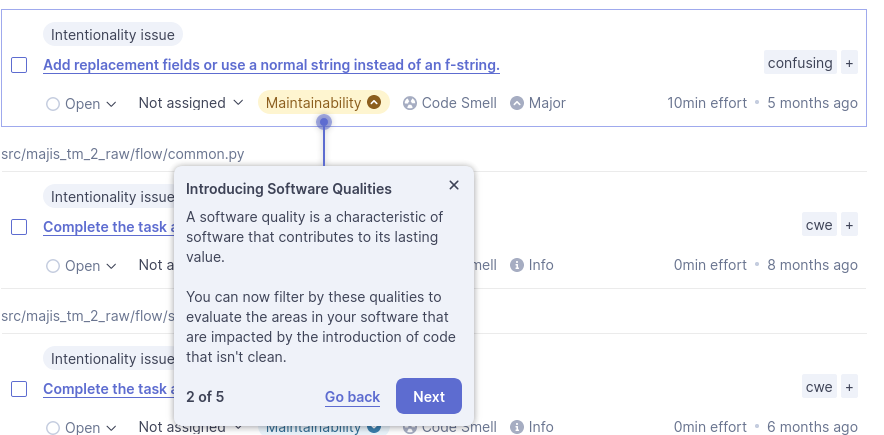

[source,bash,attributes]
-----
docker run -d --name sonarqube -p 9000:9000 -p 9092:9092 sonarqube
-----

login with admin/admin

change to admin/refact

pip install pylint pytest pytest-cov
pytest -v  tests/unit/ --cov --cov-report=xml --cov-report=html

sqp_5e14217deb6e23ad8c728041f41bd736fb478b3c

 

 \
  -Dsonar.projectKey=tm2raw \
  -Dsonar.sources=. \
  -Dsonar.host.url=http://localhost:9000 \
  -Dsonar.token=sqp_5e14217deb6e23ad8c728041f41bd736fb478b3c

image:2023-11-11T13-07-59-786Z.png[] 

image:2023-11-11T13-08-56-557Z.png[] 

image:2023-11-11T13-09-21-434Z.png[] 

image:2023-11-11T13-10-25-598Z.png[] 

Clean code

image:2023-11-11T13-13-02-542Z.png[] 

 

 

image::2023-11-11T13-14-32-923Z.png[] 

 

 

image::2023-11-11T13-17-11-927Z.png[] 

